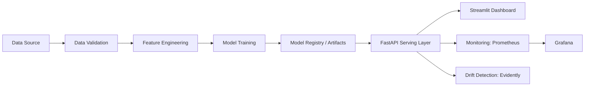
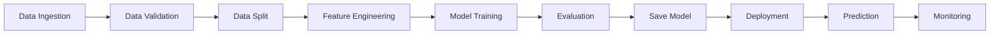

# Subscription Renewal Prediction System

Production-grade MLOps project for predicting whether a subscription account is likely to renew at the end of its current billing cycle. The system combines data pipelines, model training, API serving, interactive analytics, and monitoring to support business-facing renewal decisions in a practical deployment setup.

## Overview

This project is designed to help subscription-based businesses identify which accounts are likely to renew and which accounts may require proactive retention action. It goes beyond raw model output by translating renewal probabilities into business-friendly risk segments that teams can act on immediately.

The repository includes:

- Data validation and preparation workflows
- Feature engineering for subscription behavior signals
- Model training and artifact publishing
- FastAPI-based serving for real-time and batch inference
- Streamlit dashboard for operational and business users
- Monitoring with Prometheus, Grafana, and Evidently
- Test coverage and CI/CD-oriented project structure

## Problem Statement

For subscription businesses, knowing whether an account will renew is more actionable than generic retention scoring. Revenue, lifecycle marketing, customer success, and support teams all benefit from early visibility into renewal likelihood.

This project addresses that need by building a binary classification system that predicts:

- `1` = the account is likely to renew
- `0` = the account is at risk of non-renewal

The final prediction is then translated into operationally useful renewal risk categories so that teams can prioritize interventions, segment outreach, and improve renewal outcomes.

## Dataset & Features

The system uses a subscription account dataset representing common SaaS lifecycle and engagement signals.

### Core input features

- `monthly_usage_hours`
- `login_frequency`
- `last_login_days`
- `support_tickets`
- `payment_failures`
- `subscription_plan`

### Engineered features

The feature engineering layer creates model-ready signals such as:

- `engagement_score`
- `activity_ratio`
- `support_pressure`
- `payment_reliability`
- `usage_momentum`
- `plan_value_index`
- `risk_score`

These features help the model capture account health using product engagement, payment stability, and support burden rather than relying on raw input columns alone.

## System Architecture

The platform follows a modular MLOps architecture where data preparation, model lifecycle management, serving, dashboarding, and monitoring are separated into clear components.



### Main components

- **Data Source**: subscription account records used for training and evaluation
- **Data Validation**: schema and target checks before training
- **Feature Engineering**: transformation of business activity signals into model features
- **Model Training**: supervised learning workflow for renewal prediction
- **Model Registry / Artifacts**: versioned storage of trained model assets
- **FastAPI Serving Layer**: prediction API for real-time and batch scoring
- **Streamlit Dashboard**: interactive interface for analysts and business teams
- **Monitoring & Drift Detection**: operational metrics and data drift analysis

## Model Description

The project uses a binary classification model to estimate the probability that a subscription account will renew. The training workflow includes data preparation, train/test splitting, feature transformation, model fitting, and evaluation before the final artifact is published for serving.

From a business perspective, the most important model output is not just the predicted label, but the renewal probability. That probability becomes the foundation for downstream segmentation, prioritization, and action planning.

## Risk Segmentation Logic

The model predicts a **renewal probability** for each subscription account. To make the output easier for business teams to use, that probability is mapped into three operational categories:

```text
if proba > 0.75       -> High Renewal Probability
if 0.4 < proba <= 0.75 -> Moderate Risk
else                  -> High Churn Risk
```

### Why this matters

- Raw probabilities are useful for ML systems, but decision-makers often need simpler categories
- Risk segments help customer success teams prioritize outreach
- Marketing teams can design targeted campaigns for medium-risk accounts
- Revenue teams can focus attention on accounts with the highest likelihood of non-renewal

This translation layer improves usability by turning model output into business-friendly signals that support faster and more consistent action.

## MLOps Pipeline

The project is structured as an end-to-end machine learning workflow with repeatable stages for preparing data, training the model, publishing artifacts, and serving predictions.



### Pipeline stages

- **Data Ingestion**: load raw subscription data
- **Data Validation**: verify required columns and target integrity
- **Data Split**: create reproducible training and test datasets
- **Feature Engineering**: build derived renewal indicators
- **Model Training**: train the renewal classifier
- **Evaluation**: measure model quality on held-out data
- **Save Model**: persist trained artifacts for deployment
- **Deployment**: expose the model through the serving layer
- **Prediction**: support single-account and batch inference
- **Monitoring**: track serving health, performance, and drift

## Monitoring & Observability

The system includes monitoring components expected in a production-oriented ML workflow:

- **Prometheus** for collecting serving metrics
- **Grafana** for dashboard-based observability
- **Evidently** for data and prediction drift analysis

This setup supports:

- API-level health and metric collection
- visibility into model-serving behavior
- detection of input distribution shifts
- monitoring of prediction stability over time

Together, these components help maintain trust in the renewal prediction service after deployment.

## Dashboard Description

The project includes a Streamlit dashboard that makes the model accessible to non-engineering stakeholders while still supporting exploratory analysis.

### Dashboard capabilities

- **Single prediction**: score one subscription account interactively
- **Batch prediction**: upload a CSV file to score multiple accounts at once
- **Explainability**: show SHAP-based feature contribution insights
- **Feature importance visualization**: surface the strongest drivers behind a renewal decision

This makes the dashboard useful for customer success teams, analysts, and internal stakeholders who need both predictions and interpretable reasoning.

## Tech Stack

- **Language**: Python
- **Modeling**: scikit-learn, Optuna, SHAP
- **Data**: pandas, NumPy
- **Serving**: FastAPI, Uvicorn
- **Dashboard**: Streamlit
- **Monitoring**: Prometheus, Grafana, Evidently
- **Experiment / artifact tooling**: MLflow, joblib
- **Workflow / reproducibility**: DVC
- **Testing / quality**: pytest, flake8
- **Containerization**: Docker
- **CI/CD ready structure**: GitHub Actions-oriented repository layout

## How to Run

### 1. Install dependencies

```bash
pip install -r requirements.txt
```

### 2. Validate and prepare data

```bash
python src/data/validate_data.py --config params.yaml
python src/data/load_data.py --config params.yaml
python src/data/split_data.py --config params.yaml
```

### 3. Train the model

```bash
python src/models/train_renewal_model.py --config params.yaml --n-trials 10
```

### 4. Publish the serving artifact

```bash
python src/models/renewal_model_registry.py --config params.yaml
```

### 5. Start the API

```bash
uvicorn src.api.app:app --host 0.0.0.0 --port 8000 --reload
```

### 6. Launch the dashboard

```bash
streamlit run dashboard/streamlit_app.py
```

### 7. Generate a drift report

```bash
python src/monitoring/renewal_drift_report.py --config params.yaml
```

## Future Improvements

- Add automated model retraining triggers based on drift thresholds
- Introduce model version comparison dashboards
- Extend batch scoring with scheduled jobs and cloud storage integration
- Add role-based access control for production dashboard usage
- Track business KPIs alongside model metrics for stronger feedback loops
- Package deployment with infrastructure-as-code for cloud environments

## Conclusion

The Subscription Renewal Prediction System is a practical MLOps implementation focused on business-ready renewal intelligence. It combines predictive modeling, deployment, explainability, and observability into a single workflow that reflects how ML systems are built and operated in production environments.

By translating renewal probabilities into actionable risk segments, the system helps teams move from model output to operational decision-making with much greater clarity.
