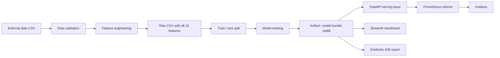

# Subscription Renewal Prediction System

A binary classification system that predicts whether a subscription account will renew at the end of its billing cycle. The project covers data preparation, feature engineering, model training, REST API serving, an interactive Streamlit dashboard with per-account SHAP explanations, and a monitoring layer built on Prometheus, Grafana, and Evidently.

---

## Dashboard preview

<!-- docs/screenshots/dashboard-overview.png does not exist yet.
     Add a screenshot to docs/screenshots/ and uncomment the line below.

-->

> **No screenshots committed yet.** Place images in `docs/screenshots/` and reference them here.  
> Suggested captures: `dashboard-overview.png`, `dashboard-batch.png`, `dashboard-drivers.png`.

---

## Contents

- [Problem statement](#problem-statement)
- [Dataset and features](#dataset-and-features)
- [Architecture](#architecture)
- [Model and explainability](#model-and-explainability)
- [Risk segmentation](#risk-segmentation)
- [Dynamic recommendations](#dynamic-recommendations)
- [Dashboard](#dashboard)
- [API](#api)
- [Monitoring](#monitoring)
- [CI/CD pipeline](#cicd-pipeline)
- [Tech stack](#tech-stack)
- [How to run](#how-to-run)
- [Future improvements](#future-improvements)

---

## Problem statement

Subscription businesses need early, account-level signals of renewal risk — not just aggregate churn rates. Customer success, lifecycle marketing, and revenue teams each benefit from knowing which accounts are very likely to renew, which are wavering, and which need immediate intervention.

This system outputs a renewal probability per account and maps it to an operational risk tier. A rule-based recommendation engine translates the signals into specific, account-tailored actions, independent of the ML model.

Target:
- `1` = account renews
- `0` = account does not renew

---

## Dataset and features

The system is trained on a synthetic subscription-account dataset that mirrors common SaaS engagement patterns.

### Core input signals

| Feature | Description |
|---|---|
| `monthly_usage_hours` | Hours of active product use in the billing month |
| `login_frequency` | Number of sessions in the month |
| `last_login_days` | Days since the last recorded login |
| `support_tickets` | Open or recent support ticket count |
| `payment_failures` | Count of failed payment attempts |
| `subscription_plan` | Plan tier: `starter`, `growth`, `business`, `enterprise` |

### Engineered features

`build_renewal_features` in `src/features/build_renewal_features.py` derives seven additional signals before training and scoring.

| Feature | Formula | Intent |
|---|---|---|
| `plan_value_index` | plan score map: starter=0.7, growth=1.0, business=1.3, enterprise=1.6 | Encodes plan-tier commitment |
| `engagement_score` | `usage_hours / (last_login_days + 1)` | Usage intensity relative to inactivity |
| `activity_ratio` | `login_frequency / (usage_hours + 1)` | Login sessions per usage hour |
| `support_pressure` | `support_tickets / (login_frequency + 1)` | Support burden relative to engagement |
| `payment_reliability` | `1 / (payment_failures + 1)` | Inverted failure count; higher = more reliable |
| `usage_momentum` | `usage_hours × log1p(login_frequency)` | Usage weighted by session frequency |
| `risk_score` | `clip(payment_failures×1.75 + last_login_days×0.12 + support_tickets×0.55 − engagement_score×0.85 − plan_value_index×0.35, min=0)` | Weighted composite risk signal |

Note: `payment_failures`, `payment_reliability`, and `risk_score` are correlated by construction. This affects how SHAP credit is distributed — see [Model and explainability](#model-and-explainability).

---

## Architecture


```mermaid
flowchart LR
    A[External data CSV] --> B[Data validation]
    B --> C[Feature engineering]
    C --> D[Raw CSV with all 13 features]
    D --> E[Train / test split]
    E --> F[Model training]
    F --> G[Artifact: model bundle .joblib]
    G --> H[FastAPI serving layer]
    G --> I[Streamlit dashboard]
    H --> J[Prometheus metrics]
    J --> K[Grafana]
    G --> L[Evidently drift report]
```

The dashboard and the API both load the model artifact directly via `RenewalPredictor`; the dashboard does **not** call the REST API at runtime.

### Components

| Component | Location | Role |
|---|---|---|
| Data validation | `src/data/validate_data.py` | Schema and target integrity checks |
| Feature engineering | `src/features/build_renewal_features.py` | Derives the 7 engineered features |
| Training | `src/models/train_renewal_model.py` | Trains, evaluates, and saves the model bundle |
| Prediction service | `src/models/renewal_predictor.py` | Shared inference class used by both API and dashboard |
| REST API | `src/api/app.py` | FastAPI with single, batch, explain, health, and `/metrics` endpoints |
| Dashboard | `dashboard/streamlit_app.py` | Interactive Streamlit UI |
| Drift monitoring | `src/monitoring/renewal_drift_report.py` | Evidently-based drift analysis with fallback |

---

## Model and explainability

### Model

The classifier is a **scikit-learn `Pipeline`** with two stages:

```
ColumnTransformer
  ├── numeric path  → SimpleImputer(median)
  │                 → PolynomialFeatures(degree=2, include_bias=False)
  │                 → StandardScaler()
  └── categorical   → SimpleImputer(most_frequent)
       (subscription_plan)
                    → OneHotEncoder(handle_unknown='ignore')
↓
LogisticRegression(C=3.0, max_iter=4000)
```

Polynomial expansion of 12 numeric features at degree 2 produces 90 transformed inputs plus 4 OHE columns (one per plan tier), giving the logistic regression 94 features. The combination allows the model to capture multiplicative interactions (e.g., `payment_failures × engagement_score`) without a tree-based architecture.

`params.yaml` carries a stale `model_name: subscription_renewal_gradient_boosting` and gradient-boosting hyperparameter ranges left over from an earlier design iteration. Neither is used by the current training code.

**Threshold selection**: after cross-validation, a validation split is used to search the range [0.35, 0.75] in 1 pp increments, choosing the threshold that maximises accuracy. The selected threshold is stored in the model bundle and used at serving time.

**Held-out metrics (from `reports/renewal_model_metrics.json`):**

| Metric | Value |
|---|---|
| Accuracy | 0.915 |
| ROC-AUC | 0.975 |
| Precision | 0.942 |
| Recall | 0.929 |
| Prediction threshold | 0.59 |

### Explainability

Per-account feature contributions use **`shap.LinearExplainer`** applied to the inner `LogisticRegression` after transforming the account through the preprocessor. This produces exact SHAP values in log-odds space — no approximation is needed for linear models.

The 90 polynomial SHAP values are folded back to the original 13 feature names:
- **Pure or quadratic terms** (`x_i`, `x_i²`) — full contribution assigned to feature `i`.
- **Cross terms** (`x_i × x_j`) — contribution split equally between features `i` and `j`.

**Practical caveat**: `payment_failures`, `payment_reliability`, and `risk_score` are algebraically correlated. When `payment_failures` increases by 1, all three change simultaneously. In the aggregated SHAP chart, the total payment-failure effect is spread across these three features and across their cross-terms with features like `engagement_score`. Individual bars will therefore look smaller than the combined group effect. A grouped permutation importance analysis (`diagnose_model.py`) confirms the combined contribution is substantial (mean ΔAUC ≈ 0.08).

The dashboard subtitle labels the backend as "LinearExplainer on LogisticRegression — exact SHAP in log-odds space" and falls back to a clearly-labelled approximate mode if SHAP is unavailable.

---

## Risk segmentation

The renewal probability is mapped to three operational tiers, defined in `get_risk_profile()`:

| Probability | Segment | Color |
|---|---|---|
| > 0.75 | High Renewal Probability | Mint / success |
| 0.40 – 0.75 (inclusive at 0.40) | Moderate Risk | Amber / warning |
| < 0.40 | High Churn Risk | Rose / danger |

Each tier carries a short advisory text used in the dashboard's full-width banner below the KPI strip.

---

## Dynamic recommendations

`build_recommendations(account, proba)` in `dashboard/streamlit_app.py` produces up to three prioritised action items by evaluating the account's actual signal values. It is entirely rule-based and runs independently of the model.

| Condition | Priority | Action |
|---|---|---|
| `payment_failures ≥ 1` | 1 (highest) | Recover billing: card-update email + finance confirmation |
| `last_login_days ≥ 30` | 2 | Re-engage dormant account: win-back campaign + CSM check-in |
| `last_login_days 14–29` | 3 | Watch engagement: value nudge before going cold |
| `login_frequency ≤ 5` or `usage_hours ≤ 15` | 3 | Lift adoption: onboarding invite + surface unused features |
| `support_tickets ≥ 3` | 2 | De-risk support: proactive CSM close-the-loop call |
| `proba > 0.75` and no risks triggered | 2 | Upsell: next plan tier + testimonial / referral ask |
| Fallback | 3 | Stable account: maintain touchpoints |

Rules are evaluated independently; results are sorted by priority and the top three are displayed. Because conditions can overlap (e.g., payment failures AND dormancy), a single account can generate two or three distinct items.

---

## Dashboard

The dashboard is a **1 090-line Streamlit application** with a custom aurora glass design system. It loads `RenewalPredictor` directly from the model artifact — no network call to the API is made.

### Layout

Two tabs in the main content area:

**Single forecast tab**

- Action bar: title and hint on the left; "Predict renewal" button pinned to the right.
- After prediction, a three-card KPI strip appears:
  - **Renewal probability** — large percentage hero figure, colour-coded to segment.
  - **Risk segment** — coloured pill (High Renewal / Moderate Risk / High Churn Risk).
  - **Recommended action** — up to three rule-based items with Tabler icons.
- Full-width advisory banner with a segment-coloured left border.
- Two-column detail section: Account snapshot table on the left; Prediction drivers bar chart on the right.

**Batch scoring tab**

- Full-width CSV drop zone.
- Styled results table (original features + `renewal_prediction`, `renewal_probability`, `renewal_label`).
- Segment summary counts below the table.
- Download button for the scored CSV.

### Sidebar

Six slider controls (usage, login frequency, last-login days, support tickets, payment failures) plus a plan selectbox. Current values are displayed inline next to each slider in the appropriate accent colour (teal for positive signals, rose for risk signals). Two quick-preset buttons load a "High risk" or "High engagement" scenario.

### Design system

The aurora glass palette uses `rgba` layers over a `#13102B` base with three radial gradient mesh blobs (violet, blue, teal). All controls (sliders, inputs, buttons, the file uploader) are re-styled with a shared aurora CSS token set. No third-party component library is used — all customisation is injected via `st.markdown(..., unsafe_allow_html=True)`.

---

## API

`src/api/app.py` is a FastAPI application. Start it with:

```bash
uvicorn src.api.app:app --host 0.0.0.0 --port 8000
```

### Endpoints

| Method | Path | Description |
|---|---|---|
| `GET` | `/` | Service info and feature list |
| `GET` | `/health` | Liveness check and artifact path |
| `POST` | `/predict-renewal` | Score one account |
| `POST` | `/predict-renewal/batch` | Score up to 1 000 accounts |
| `POST` | `/explain-renewal` | Score one account and return top SHAP factors |
| `GET` | `/metrics` | Prometheus exposition format |

### Prometheus metrics

| Metric | Type |
|---|---|
| `renewal_prediction_requests_total` | Counter |
| `renewal_prediction_errors_total` | Counter |
| `renewal_model_latency_seconds` | Histogram (buckets 10 ms – 5 s) |
| `renewal_model_error_rate` | Gauge |

---

## Monitoring

Drift detection (`src/monitoring/renewal_drift_report.py`) compares the training distribution against the test split using **Evidently** (`DataDriftPreset` + `ClassificationPreset`). If Evidently's report generation fails, a manual column-wise mean-difference comparison is used as a fallback. Both paths write to `reports/renewal_drift_report.json`.

Prometheus scrapes the API at `/metrics` every 15 seconds (configured in `monitoring/prometheus.yml`). A Grafana dashboard definition lives in `monitoring/grafana/dashboards/`.

---

## CI/CD pipeline

`.github/workflows/ci-cd.yaml` defines eight sequential jobs:

| Job | Action |
|---|---|
| `data_validation` | `python src/data/validate_data.py` |
| `test_and_lint` | `pytest` |
| `train_model` | `python src/models/train_renewal_model.py` |
| `monitor_drift` | `python src/monitoring/renewal_drift_report.py` |
| `build_image` | `docker build` → `ghcr.io/<owner>/subscription-renewal-system:latest` |
| `publish_image` | Push to GHCR with `GITHUB_TOKEN` |
| `deploy` | Placeholder echo step |
| `monitor_production` | Health-check curl (placeholder) |

---

## Tech stack

| Area | Library / tool | Notes |
|---|---|---|
| Language | Python 3.11 | |
| Modeling | scikit-learn | LogisticRegression pipeline |
| Explainability | shap | LinearExplainer on inner LR |
| Data | pandas, NumPy | |
| Serving | FastAPI, Uvicorn | |
| Dashboard | Streamlit | Custom aurora-glass CSS |
| Monitoring | Prometheus, Grafana, Evidently | |
| Serialisation | joblib | Model bundle persistence |
| Testing | pytest, flake8 | |
| Containerisation | Docker | Image pushed to GHCR |
| CI/CD | GitHub Actions | 8-job workflow |
| Optuna | In `requirements.txt` | Installed but not called in training code |
| MLflow, DVC | In `requirements.txt` | Installed but not integrated in current code |

---

## How to run

All commands are run from the project root.

### Install dependencies

```bash
pip install -r requirements.txt
```

### Prepare data

```bash
python src/data/validate_data.py --config params.yaml
python src/data/load_data.py --config params.yaml
python src/data/split_data.py --config params.yaml
```

### Train the model

```bash
python src/models/train_renewal_model.py --config params.yaml
```

`--n-trials` is accepted but the current training code uses a fixed `LogisticRegression(C=3.0)` — no Optuna search is performed.

### Sync the artifact to the serving path

```bash
python src/models/renewal_model_registry.py --config params.yaml
```

### Start the API

```bash
uvicorn src.api.app:app --host 0.0.0.0 --port 8000 --reload
```

### Launch the dashboard

```bash
streamlit run dashboard/streamlit_app.py
```

### Generate a drift report

```bash
python src/monitoring/renewal_drift_report.py --config params.yaml
```

### Run the model diagnostic

```bash
python scripts/diagnose_model.py
```

Prints permutation importances, grouped payment-cluster importance, held-out metrics, and a controlled `payment_failures` sweep to verify signal sensitivity.

---

## Future improvements

- Replace the fixed LogisticRegression with a tuned gradient-boosting model (GBM hyperparameter ranges are already in `params.yaml`) and re-enable the Optuna search that the config anticipates.
- Integrate MLflow tracking for experiment comparison across training runs.
- Activate DVC for data and model versioning to make the pipeline reproducible from any checkpoint.
- Add automated retraining triggers when the Evidently drift score exceeds a configurable threshold.
- Extend the grouped-importance view from `diagnose_model.py` into the dashboard so users can see the payment-cluster and engagement-cluster contributions directly.
- Complete the `deploy` and `monitor_production` CI/CD jobs with a real target environment.
- Add role-based access control if the dashboard is exposed beyond a trusted internal network.
